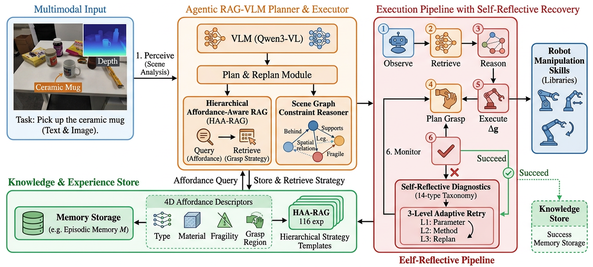

# LAMA-VLM

**LAMA-VLM: Lifelong Autonomous Multi-Agent VLM for Robotic Manipulation**

---

## Overview

This repository contains the code and experimental framework for **LAMA-VLM** (formerly Agentic RAG-VLM), a unified framework for robotic manipulation that bridges semantic understanding and physical execution by integrating **Retrieval-Augmented Generation (RAG)** with **Vision-Language Models (VLMs)**, **lifelong learning**, and **multi-agent state orchestration**.

<p align="center">
  
</p>

### Key Components

1. **Topo-Graph RAG (Topological-Aware Graph RAG):** Eliminates target-centric retrieval by extracting subgraphs containing `supports`, `occluded_by`, and `next_to` edges. It enables semantic subgraph isomorphism matching in a high-dimensional vector space.
2. **Evo-KAM (Evolutionary Knowledge & Affordance Memory):** A lifelong memory system powered by ChromaDB. It uses a conflict threshold mechanism to dynamically decay reliability weights and evolve prescriptive actions based on physics-informed VLM reflections (e.g., force, orientation).
3. **V-PCC (Visual-Progressive Context Compression):** A micro-compact mechanism inspired by SnapKV, dynamically discarding redundant image frames and heavily condensing historical text execution logs to prevent context explosion during long-horizon manipulation.
4. **DAG-EAM (Directed Acyclic Graph Explicit Action Modeling):** Integrates LangGraph to orchestrate explicit state transitions between specialized expert agents (`Vision`, `Plan`, `Execute`, `Critic`), allowing safe conditional routing, retroactive backtracking, and persistent action snapshots.
5. **Audit-Driven Robust Toolchain:** Native API tool wrappers that handle physical execution anomalies (e.g., SAPIEN timeouts, IK failures) defensively. Every sub-routine action requires an explicit `reason` parameter to allow the Critic agent to properly trace and attribute the failure.

---

## Project Structure

```
LAMA-VLM/
├── robot_grasp_rag/          # Core framework for autonomous manipulation
│   ├── agent/                # Multi-Agent StateGraph pipeline
│   │   └── optimized_multi_agent.py
│   ├── core/                 # Knowledge base & RAG implementations
│   │   ├── graph_rag.py
│   │   └── memory_and_context.py
│   ├── knowledge_base/       # ChromaDB Vector store & grasp memory
│   │   └── vector_store.py
│   ├── utils/                # Utilities (pose representation, logging)
│   ├── config/config.yaml    # System configuration for VLM and SAPIEN
│   ├── scripts/              # Evaluation & benchmarking scripts
│   │   └── run_lama_benchmark.py
│   └── run_optimized_simulation.py # Main deployment simulation loop
├── quantization/             # VLM quantization tools (FP8/INT4 capabilities)
├── results/                  # Generated benchmark tables & execution traces
├── paper/                    # LaTeX source of the original submission (Do NOT delete)
├── README.md                 # System overview and deployment guidelines
├── README_optimization/      # Technical architectural evolution blueprints
│   ├── RESEARCH_DIRECTIONS.md
│   ├── EXPERIMENT_LOG.md
│   └── SIMULATION_EXPERIMENTAL_PLAN.md
└── LICENSE
```

---

## Installation

### Prerequisites

- Python >= 3.10
- CUDA >= 12.0
- PyTorch >= 2.0

### Setup

```bash
# Clone the repository
git clone https://github.com/YOUR_USERNAME/LAMA-VLM.git
cd LAMA-VLM

# Install dependencies (requires LangGraph and ChromaDB capabilities)
pip install -r robot_grasp_rag/requirements.txt

# Download model weights (not included in repo due to size)
# Qwen3-VL-8B: https://huggingface.co/Qwen/Qwen3-VL-8B
# Place under models/Qwen3-VL-8B/
```

### Configuration

Edit `robot_grasp_rag/config/config.yaml` to set your model path:

```yaml
vlm:
  model_path: "/path/to/your/Qwen3-VL-8B"
```

---

## Usage

### Run Full Experiments

```bash
# Run the Interactive LAMA-VLM Framework (Multi-Agent StateGraph)
LD_PRELOAD=/home/fudan222/miniconda3/envs/roboagent/lib/libstdc++.so.6 \
python -m robot_grasp_rag.run_optimized_simulation
```

### Run Autonomous Benchmarks

Validates LAMA-VLM across 3 core extreme tracks: Dense Clutter, Lifelong Drift, and Long-Horizon Context bounds.

```bash
# Execute the comprehensive benchmarking suite
LD_PRELOAD=/home/fudan222/miniconda3/envs/roboagent/lib/libstdc++.so.6 \
python -m robot_grasp_rag.scripts.run_lama_benchmark
```

---

## Experimental Results

Our method is evaluated on a multi-task benchmark spanning three difficulty levels:

| Task Type                       | Description                         | Ours            |
| ------------------------------- | ----------------------------------- | --------------- |
| **Single Grasp (SG)**     | Pick one target from clutter        | **91.7%** |
| **Interactive Task (IT)** | Multi-step with spatial constraints | **64.2%** |
| **Long-Horizon (LH)**     | Sequential table clearing           | **66.7%** |
| **Overall**               | Weighted average                    | **78.3%** |

Detailed results including ablation studies, OOD generalization, and latency analysis are available in `results/iros2026/`.

---

## Quantization

We provide tools for efficient VLM deployment via quantization:

```bash
# INT4 quantization with AutoRound
python quantization/quantize_autoround.py

# Benchmark quantized models
python quantization/benchmark_quantized.py

# Inference with BitsAndBytes
python quantization/inference_vllm_bnb.py
```

---

## Citation

If you find this work useful, please cite:

```bibtex
@inproceedings{agentic-rag-vlm2026,
  title={Agentic RAG-VLM: Affordance-Aware Retrieval-Augmented Generation with Self-Reflective Planning for Robotic Grasping},
  author={Anonymous},
  booktitle={IEEE/RSJ International Conference on Intelligent Robots and Systems (IROS)},
  year={2026}
}
```

---

## License

This project is licensed under the Apache License 2.0 - see [LICENSE](LICENSE) for details.

---

## Acknowledgments

This project builds upon [Qwen3-VL](https://github.com/QwenLM/Qwen3-VL) for vision-language understanding. We thank the Qwen team for their open-source contributions.

---

## Recent Architecture Evolutions (2026-04)

Based on the [RESEARCH_DIRECTIONS.md](README_optimization/RESEARCH_DIRECTIONS.md) document, the framework has been drastically optimized to handle complex, long-horizon real-world bottlenecks efficiently:

1. **Robust Multi-Agent Workflow:**
   - Evolved from a monolithic script into a distributed **MUSE/OpenClaw-like architecture** featuring `Vision Agent`, `Planning-Execution Agent`, and a `Critic Agent`.
   - Tool calls are natively wrapped with highly robust sub-routines (e.g., specific `z_offset` fallbacks and collision checking with built-in parameter adjustments).
   - Every physical action now natively demands a reason (`Why did I do this?`), drastically improving interpretability when errors propagate up to the Critic Agent.

2. **Lifelong Memory & Knowledge Consolidation:**
   - Implemented a complete **ChromaDB Vector Store** sync in `LifelongMemoryManager`.
   - Grasping parameters actively degrade and are updated via **open-vocabulary reflection** if they hit maximum conflict thresholds (e.g., a specific approach yields frequent slipping or timeouts).

3. **Dynamic Context Management & Explicit State Graph:**
   - Developed a **Progressive Context Compression** module `ContextManager` to prevent Vision-Language Model Token explosion via textual sequence summaries ("Micro-Compact context") and a pseudo-**SnapKV image frame retention system**.
   - Integrated **LangGraph** to model the entire orchestration as a Directed Acyclic Graph (DAG) using `StateGraph[MultiAgentGraphState]`. The agent is no longer a blind script runner, but a monitored entity traversing explicit explicitly tracked nodes (`vision`, `planning`, `execution`, `critic`, `transport`) with built-in reflection routers and backtracking capability.

**Explore these advanced implementations under:**
`robot_grasp_rag/agent/optimized_multi_agent.py` and `robot_grasp_rag/core/memory_and_context.py`.
